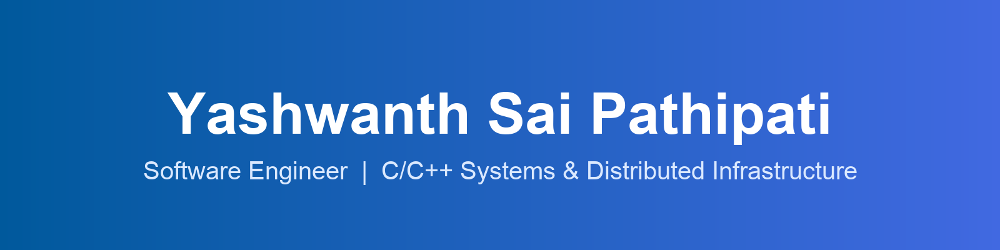

<!-- BANNER -->
<div align="center">



<a href="https://yashwanthsaipathipati.netlify.app"></a>
<a href="https://linkedin.com/in/yashwanthsai-pathipati/"></a>
<a href="mailto:yashwanthsaipathipati@gmail.com"></a>


<br/>


</div>

---

### 👨‍💻 About Me

```c
struct Engineer {
    const char *name      = "Yashwanthsai Pathipati";
    const char *role      = "Software Engineer — Systems & Distributed Infra";
    const char *company   = "Ex-Zoho Corporation (1.5+ yrs production C/C++)";
    const char *education = "M.S. Computer Science @ USF (GPA 3.97)";
    const char *focus[]   = { "PostgreSQL internals", "Horizontal sharding",
                              "Memory management", "Concurrency & performance" };
    const char *location  = "Tampa, Florida 🇺🇸";
};
```

I ship **production C/C++ backend systems for distributed databases** — built a PostgreSQL extension for hash-based horizontal sharding across worker nodes, tuned query planners with GDB & Valgrind, and coordinated zero-downtime cluster migrations. I like the parts of the stack most people avoid: allocators, mutexes, WAL streams, and profiler flame graphs.

---

### 🛠️ Tech Stack

<div align="center">


</div>

| Domain | Technologies |
| --- | --- |
| **Languages** | C · C++ (STL, RAII, templates) · Python · Java |
| **Systems & Concurrency** | Distributed Systems · Multithreading · Mutex · Lock-free · Custom Allocators · System Design |
| **Databases** | PostgreSQL · MySQL · Query Optimization · Data Partitioning · Logical Replication |
| **Backend** | REST APIs · Node.js · Flask |
| **HPC** | OpenCL · CUDA · GPU Optimization |
| **Tooling** | Git · Bash · GDB · Valgrind · CMake · Docker · Linux |
| **AI/ML** | PyTorch · Transformers · Knowledge Distillation · LoRA |

---

### 🚀 Featured Projects

<table>
<tr>
<td width="50%" valign="top">

#### 🗄️ [Mini Distributed PostgreSQL Extension](https://github.com/PathipatiYashwanthSai/mini-distributed-postgres)
`C` · `PostgreSQL` · `Distributed Systems`

C extension distributing table data across worker nodes via **hash-based sharding** — coordinator metadata, deterministic shard-to-worker mapping, shard-key query routing, and benchmark scripts over Dockerized nodes.

</td>
<td width="50%" valign="top">

#### 🧠 [C++ Memory Management Framework](https://github.com/PathipatiYashwanthSai/Memory-Management-Framework)
`C++` · `Custom Allocator` · `Systems`

Hierarchical memory-context system inspired by PostgreSQL's allocator — **8-byte aligned payloads**, free-list **O(1) reuse**, and RAII-compliant typed object lifecycles via templates.

</td>
</tr>
<tr>
<td width="50%" valign="top">

#### 🤖 [Sentiment Analysis — Distillation & LoRA](https://github.com/PathipatiYashwanthSai/Sentiment-Analysis-Using-Knowledge-Distillation)
`PyTorch` · `Knowledge Distillation` · `LoRA`

Distilled BERT → DistilBERT student: **46% faster, half the memory**, 90% acc / 91% F1 on SST-2 — and beats BERT on unseen IMDB.

</td>
<td width="50%" valign="top">

#### 📡 [DSP Learning Platform](https://github.com/PathipatiYashwanthSai/DSP-Algorithms)
`HTML` · `CSS` · `JavaScript` · `Bootstrap` · `Jekyll`

Interactive platform implementing **FFT, convolution, and digital filtering** on user-defined signals with real-time output. Led a 4-member team.

</td>
</tr>
</table>

---

### 🌐 Portfolio

<div align="center">

I write about my work and showcase projects in more depth on my personal site.

<a href="https://yashwanthsaipathipati.netlify.app">

</a>

**→ [yashwanthsaipathipati.netlify.app](https://yashwanthsaipathipati.netlify.app)**

</div>

---

<div align="center">


</div>
